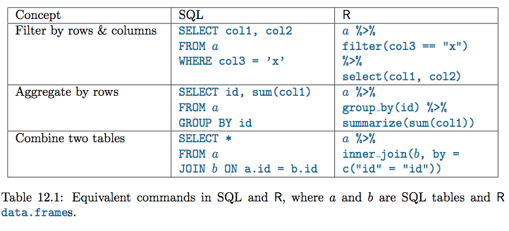

```{r setup, include = FALSE}
library(tidyverse)
theme_set(theme_bw()) # change theme for ggplot2
knitr::opts_chunk$set(
  tidy    = FALSE,       # display code as typed
  size    = "small",     # slightly smaller font for code
  message = FALSE)  # suppresses some unwanted output
```

# Integrating SQL with R and `ggplot2`

## SQL vs `dplyr`

Now that you (are on your way to) know(ing) two different data wrangling languages (`dplyr` and `SQL`), it's worth spending a minute thinking about their relative strengths and weaknesses.  Here are a few strengths of each one:

`dplyr`

* Runs on the same computer you're working on
* Has a "functional programming" style: Each wrangling verb has a clear input and output (whether this is a strength depends on your attitude toward functional programming, I suppose)
* Is integrated into the larger `tidyverse`
* Is more flexible: can combine standard verbs with arbitrary R code, incorporate code in custom functions, etc

`SQL`

* Is more efficient for large datasets
* Code reads (sort of) like English sentences (this is also a matter of taste; the code is probably 'easier on the eyes' than R code, but I find it harder to pull apart than the functional style of R; but... your mileage may vary)
* Is more widely used in industry outside data science specifically (though R and the tidyverse have gotten far more widely used in the last few years)

There are two big reasons we can't rely exclusively on SQL, however: 

* it doesn't support plotting
* it doesn't support statistical modeling

So if we want to do more than show some tables, we need to be able to pass the results of our SQL queries back into R, so we can create graphs and (though we're not focusing on this in this class) models.


## Goal of this lab

Use SQL together with `ggplot` to produce visualizations from large datasets.

In particular, we will try to verify the following claim from the FiveThirtyEight article [here](https://fivethirtyeight.com/features/fastest-airlines-fastest-airports/):

"In 2014, the 6 million domestic flights the U.S. government tracked required an extra 80 million minutes to reach their destinations. The majority of flights -- 54 percent -- arrived ahead of schedule in 2014. (The 80 million minutes figure cited earlier is a net number. It consists of about 
115 million minutes of delays minus 35 million minutes saved from early arrivals.)"

as well as to reproduce the graphic therein (shown below).


## Setup Boilerplate and Reference (Repeated from Labs 13-14)

We need to load packages and set up a connection to the server again.

**Code:**
```{r, message = FALSE}
library(dbplyr)  ## Note the 'b'; this is not dplyr
library(mdsr)    ## Package for our book
library(RMySQL)  ## Standard R/SQL interface package
db <- dbConnect_scidb("airlines")
```

For convenience here is the list of basic verbs again:


**Remember:** Verbs lower in the list must appear _after_ verbs higher in the list when constructing queries.

Here's the `dplyr` to `SQL` translation summary again:



And, it bears repeating, in all caps:

**IMPORTANT: ALWAYS `LIMIT` YOUR QUERIES, LEST YOU TRY TO FETCH HUNDREDS OF MILLIONS OF RECORDS AND BREAK EVERYTHING FOR EVERYONE!**

One last reminder: to designate a code chunk "SQL", use `{sql connection=db}` in the chunk options (where `db` is whatever you named your connection in a previous R code chunk) in place of the `r` that is usually there.

## Extracting the necessary summary statistics

1. Before diving into writing any queries, examine the quote and the graph together with your group and work together to sketch out what the summarized data table(s) should look like to verify the quote and reproduce the graph. Note that flights are only classified as a "late arrival" if the delay is 15 minutes or more.  What are the rows, what columns are needed, which of these correspond to columns in the `flights` data, etc.? Remember you can use use `DESCRIBE` in an SQL chunk to see an overview of the columns.  For columns that represent summary statistics, how can these be computed? Write down the computation steps in sentences; not in code yet.  Working backwards like this can be a good way to approach a wrangling+visualization problem.

To reverse engineer this graph, I will need a data table where there are three columns: one that counts the total number of times a flight is delayed, and then two for "dep_delay," subdivided into 15-119 minutes and 120+ minutes, grouped into Southwest, Frontier, American, United, Jet Blue, US Airways, Virgin America, Delta, Alaska, and Hawaiian. After doing this I will do another summarize to calculate the percentages out of the third totaled column, and then I can construct a rotated, stacked geom_col plot with the groups. 

```{sql connection=db}
DESCRIBE carriers;
```

```{r}
db <- dbConnect_scidb("airlines")
```

2. Take the `flights` dataset, and write an SQL query to calculate the necessary summary information.  To save computing strain, just use the flights that took place on your birthday in 2014, rather than all of 2014, and multiply each variable (that isn't a percentage) by 365 to extrapolate to the whole year (there are of course seasonal differences in flight delays, so this is not a representative sample, so we shouldn't expect extremely similar results to the FiveThirtyEight article). **A tip:** you can use commands of the form `if(<condition>, <value if true>, <value if false>)` in SQL to create a variable that has one value if a condition is met and another value if it isn't (the angle brackets indicate placeholders, and shouldn't actually be typed).  **Note:** The result should just be one row, but include a `LIMIT` clause anyway, just in case the result isn't what you intend.
```{sql connection=db}
DESCRIBE carriers;
```


```{sql connection=db}
SELECT 
(SUM(1))*365 AS `SUM_FLIGHTS`,
(SUM(IF(dep_delay BETWEEN 15 AND 119, 1, 0)))*365 AS `SHORT_DELAYS`,
(SUM(IF(dep_delay > 120, 1, 0)))*365 AS `LONG_DELAYS`,
carrier, 
year, 
month,
day
FROM flights
WHERE year=2014 AND
month=12 AND
day=23
GROUP BY carrier
LIMIT 0,100000;

```


My birthday is in the winter so there are more delays, but even for less travel-challenged times of year, you should notice that the numbers still don't quite match what's in the quote.

The total minutes early come close, but the total minutes late is way under what FiveThirtyEight reports.  It turns out, when you read FiveThirtyEight's methodology, that _cancelled_ flights have `arr_delay = 0` in the data, and so these aren't contributing to the statistics we've computed; but these flights obviously hold travelers up.  

FiveThirtyEight did some modeling to estimate an `arr_delay` number for cancelled flights; hence the discrepancy.  We won't try to reproduce what they did; instead as an approximation, we will consider cancelled flights to be delayed by 4.5 hours (following another quote in the article suggesting a "quick and dirty" estimate of 4-5 hours for each cancelled flight).


3. Revise your query to add 270 minutes to each canceled flight. **Hint:** Cancelled flights show an arrival delay of 0 as-is, so you can modify your `if()` statement that adds up the minutes late, tallying 270 for a cancelled flight instead of zero.

For this exercise I just added (arr_delay>0) as an OR condition to the `LONG_DELAYS` result, I figured flights only have to meet one condition to be considered late by a long time.

```{sql connection=db}
SELECT 
(SUM(1))*365 AS `SUM_FLIGHTS`,
(SUM(IF(dep_delay BETWEEN 15 AND 119, 1, 0)))*365 AS `SHORT_DELAYS`,
(SUM(IF(dep_delay > 120 OR arr_delay=0, 1, 0)))*365 AS `LONG_DELAYS`,
carrier, 
year, 
month,
day
FROM flights
WHERE year=2014 AND
month=12 AND
day=23
GROUP BY carrier
LIMIT 0,100000;
```


Now let's create the dataset for the graph.  We're going to need to pull the results into R, but let's first write the query in SQL to confirm that we get what we want.

4. Write an SQL query to produce a data table with the summary statistics needed for the graph.  Don't worry about the `pivot_longer()` step that we'll need to get the data into the "tidy" format; we'll do that in R later.  **Hint:** for the labels, you'll want the `name` field from the `carriers` data table.  **Note:** that the graph is sorted in descending order by percentage of short delays.

```{sql connection=db}
SELECT 
(SUM(1))*365 AS 'SUM_FLIGHTS',
(SUM(IF(dep_delay BETWEEN 15 AND 119, 1, 0)))*365 AS 'SHORT_DELAYS',
(SUM(IF(dep_delay > 120 OR arr_delay=0, 1, 0)))*365 AS 'LONG_DELAYS',
flights.carrier, 
carriers.name
FROM flights
LEFT JOIN carriers ON flights.carrier = carriers.carrier
WHERE year=2014 AND
month=12 AND
day=23
GROUP BY flights.carrier
ORDER BY SHORT_DELAYS DESC
LIMIT 0,100000;
```

## Bringing the result set into R

We're now done with the SQL part of the process! 

Now that we have a small dataset, we can turn it into an R data frame and do our finishing wrangling touches in `dplyr` and our visualization in `ggplot2`.

5. Once you have your SQL query working, create an R object that contains the text of the query as one big quoted string (you can include the line breaks).  You can call it whatever you want; I will refer to this variable below as `query`.

```{r}
query<- "SELECT 
(SUM(1))*365 AS 'SUM_FLIGHTS',
(SUM(IF(dep_delay BETWEEN 15 AND 119, 1, 0)))*365 AS 'SHORT_DELAYS',
(SUM(IF(dep_delay > 120 OR arr_delay=0, 1, 0)))*365 AS 'LONG_DELAYS',
flights.carrier, 
carriers.name
FROM flights
LEFT JOIN carriers ON flights.carrier = carriers.carrier
WHERE year=2014 AND
month=12 AND
day=23
GROUP BY flights.carrier
ORDER BY SHORT_DELAYS DESC
LIMIT 0,100000;"
```


6. Having defined the `query` string, create an R data frame that contains the relevant information with `db %>% dbGetQuery(query) %>% collect()`. The use of `collect()` here brings the actual data from the table into memory; not just a pointer to a "view" of the data on the remote server, so don't do this until you know that your query produces the small result set you want.

```{r}
delays <- db %>% dbGetQuery(query) %>% collect()
```

## Cleaning up the labels

Getting the airline names to display as they are in the graph will require some text manipulation.  For one thing, we want to strip away the formal company identifiers like `Co.` and `Inc.`.  Moreover, we don't really need the `Airlines` and `Airways` bits.

We can use the `gsub()` function to find these substrings and replace them.  The syntax for this uses what's called "regular expressions"; essentially a pattern matching language that lets us define a variety of more or less general "wildcards".  Here are the `gsub()` commands we want (I have `eval = FALSE` set for this chunk because this code depends on `delays` having been created in the previous exercises, so it won't run until that's happened. You'll need to remove this before you Knit so the chunk actually runs)

```{r, eval = FALSE}
delays <- delays %>%
  ## Replaces Airlines, Airways or Air Lines with nothing
  mutate(name = gsub("Air(lines|ways| Lines)", "", name)) %>%
  ## Replaces Inc., Co., or Corporation with nothing
  ## Note the need for \\ before a period; the period 
  ## has a special meaning in regular expressions
  mutate(name = gsub("(Inc\\.|Co\\.|Corporation)", "", name)) %>%
  ## Removes any parentheticals. Here we see the "special"
  ## meaning of the period: it stands for "match any single
  ## character" (except a line-break). 
  ## It is followed by a *, which acts as a 
  ## 'modifier' on the previous string element; in this case
  ## the period: the modifier says "match zero or more 
  ## instances of the preceding thing". So .* will match 
  ## basically any string that doesn't include a line
  ## break.
  mutate(name = gsub("\\(.*\\)", "", name)) %>%
  ## The $ is a special character that represents
  ## the end of a line; and the + is like the *,
  ## except it will only match if there is at least
  ## one instance of the preceding character.
  ## So the pattern below will match one or more
  ## spaces that occur at the end of a string.
  ## We replace that whitespace with nothing.
  mutate(name = gsub(" *$", "", name))
delays
```

You'll notice that you get more airlines than appear in the graph.  We could do some consolidation, but we'll set this aside for now.


## Pivoting the data to "long" form

For visualizing this data, we'll want to create a single `pct` column representing percentages of both delay categories, and a `delay_type` column indicating whether the percentage refers to short or long delays.  This is a job for `pivot_longer()`.  

Remember that `pivot_longer()` has a `cols=` argument where we specify the names of columns we're "stacking", a `names_to` argument where we specify a name for the new grouping variable, and a `values_to=` argument where we specify a name for the new merged quantitative variable.


7. Execute an appropriate `pivot_longer()` to obtain a dataset that has `carrier`, `name`, `delay_type` (short or long), `pct_of_type`. 

```{r}
delays_pct <- delays %>%
  mutate(
    short = (SHORT_DELAYS / SUM_FLIGHTS)*100,
    long = (LONG_DELAYS / SUM_FLIGHTS)*100 
    ) %>%
  select(carrier, name, short, long) 

delays_longer <- delays_pct %>%
  pivot_longer(cols = c("short", "long"), names_to = "delay_type", values_to = "pct_of_type")

```


## Creating the graph

Most of the work is done now; all that remains is to actually produce the bar graph.  Some tips here: don't forget to use `stat="identity"` with `geom_bar()`, since we have precomputed the percentages.  

You may need to reorder the label variable so the airlines appear in descending order of short delays. You can do this with `reorder(<variable to be reordered>, <variable to define the ordering>, max)` (don't type the angle brackets). This iteratively applies the `max` function to the values of the `<variable to define the ordering>`, and then finds the matching value of the `<variable to be reordered>`, and puts it first in the order. Then it does it again with the values that remain. Etc.

8. Construct the barplot with the bars oriented vertically first, then use ` + coord_flip()` in your `ggplot` chain to turn it sideways. (**Note:** To get the percentages to display on the bars the way they are in the FiveThirtyEight graph, we can use `geom_text()`. However, it's a bit awkward to specify the "y" coordinate (which will become the "x" coordinate after flipping the coordinates) for the labels from the long data, since the labels for the longer delays are positioned based on the percentage of short delays. So as a hack you may want to join the long and wide forms of the data so you have the percent of short delays in every row.) Use `scale_y_continuous()` to set the limits on the "y" axis.  Load the `ggthemes` library and use `theme_fivethirtyeight()` to get closer to the aesthetic they use.

```{r}
library(ggthemes)
delays_joined <- delays_longer %>%
  left_join(delays_pct, by = "carrier") %>%
  arrange(desc(short))

delays_plot <- delays_joined %>%
  arrange(desc(short)) %>%
  ggplot(aes(fill = delay_type, x = reorder(name.x, short, max), y = pct_of_type, group = delay_type)) +
  geom_bar(stat = "identity", position = "stack") +
  geom_text(aes(label = str_trunc(as.character(short), 5, side = "right", ellipsis = "%"), y = short-5), cex = 3) +
  geom_text(aes(label = str_trunc(as.character(long), 5, side = "right", ellipsis = "%"), y = short+4), cex = 3) + 
  theme_fivethirtyeight() +
  scale_fill_discrete(name = "Delay Type", labels = c("FLIGHTS DELAYED 120+ MINUTES, \nCANCELED OR DIVERTED", "FLIGHTS DELAYED \n15-119 MINUTES")) +
  theme(legend.position = "top") +
  scale_y_continuous(name = "Percentage of All Flights", breaks = c(10,20,30,40,50,60,70,80,90,100), limits = c(0,100)) +
  coord_flip() +
  ggtitle("AirTran's Delays are Short; Envoy Air's are Long")

delays_plot 

```

10. Post your graph (not the code) to `#lab15` in Slack